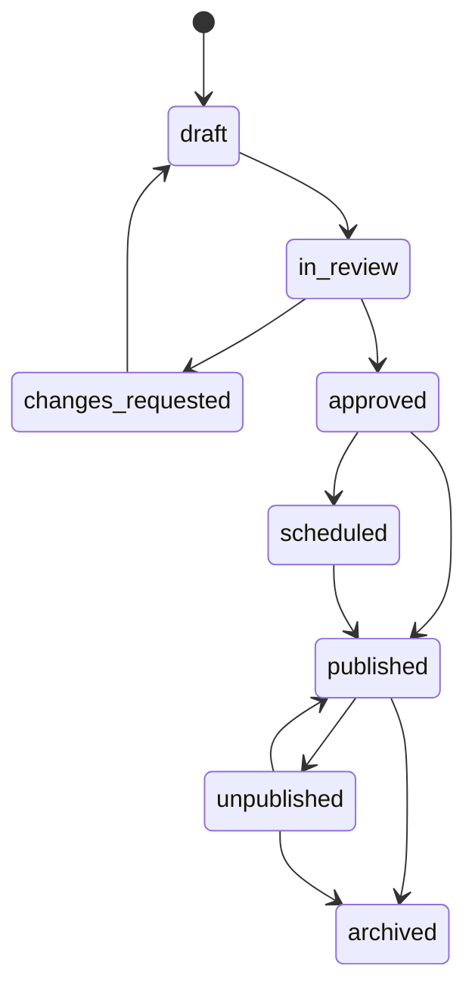

# Spesifikasi Backend CMS dan Maintenance Desa Cihawuk

Versi 1.0 — 18 September 2026  
Dokumen pendamping `prompt-master-desa-cihawuk(1).md` dan `modul-frontend-data-desa-cihawuk.md`

## 1 Tujuan dan hasil akhir

Bangun backend yang memungkinkan petugas Desa Cihawuk mengelola frontend publik, data desa, struktur organisasi, potensi, fasilitas, media, dokumen, transparansi anggaran, aset dan pengaturan modul tanpa mengubah source code untuk pekerjaan konten rutin.

Backend harus mudah digunakan oleh operator nonteknis, tetapi tetap memiliki verifikasi, permission, histori, rollback, dan audit log. Backend bukan page builder bebas. Admin hanya dapat menggunakan jenis komponen dan variasi layout yang sudah disediakan dan diuji developer.

Dokumen ini memperinci CMS dan maintenance. Jika terdapat konflik:

1. aturan keamanan, privasi, data dan domain pada prompt master tetap berlaku;
2. pemetaan konten publik mengikuti modul frontend;
3. dokumen ini menentukan cara pengelolaan melalui backend.

## 2 Prinsip desain backend

1. **Content driven**: konten frontend berasal dari database dan versi publik, bukan string yang tersebar di view.
2. **Structured content**: data utama disimpan pada tabel relasional. JSON hanya untuk konfigurasi tampilan yang terbatas.
3. **Preview before publish**: perubahan draft tidak langsung mengubah halaman publik.
4. **Maker checker publisher**: pembuat, pemeriksa dan penerbit dapat dipisahkan berdasarkan permission.
5. **Versioned and recoverable**: setiap publikasi menghasilkan snapshot yang dapat ditinjau dan dipulihkan.
6. **Archive instead of delete**: konten yang sudah mempunyai histori tidak dihapus permanen melalui UI rutin.
7. **Safe defaults**: modul baru, data hasil impor dan konten sensitif dimulai sebagai nonpublik.
8. **Server side enforcement**: permission, validasi, sanitasi dan status diperiksa server; menyembunyikan tombol bukan pengamanan.
9. **Mobile usable**: fungsi pemeriksaan, upload foto, preview dan audit dasar dapat digunakan dari ponsel.
10. **Maintainable in CI3**: gunakan controller tipis, service/domain layer, repository/model terpisah, form validation dan transaksi database.

## 3 Struktur sidebar backend

Menu hanya tampil jika pengguna mempunyai permission. Hilangkan menu kosong dan menu demo SB Admin 2.

```text
Dashboard
├── Layanan Warga
│   ├── Pengaduan dan Aspirasi
│   ├── Input dari Loket
│   ├── Disposisi dan Tugas
│   └── Monitoring SLA
├── Website dan CMS
│   ├── Pengaturan Beranda
│   ├── Halaman Publik
│   ├── Profil Desa
│   ├── Sejarah dan Visi Misi
│   ├── Menu dan Navigasi
│   ├── Berita dan Pengumuman
│   ├── Agenda
│   ├── Galeri
│   └── Dokumen Publik
├── Data Desa
│   ├── Dataset dan Versi
│   ├── Indikator
│   ├── Observasi
│   ├── Impor dan Staging
│   ├── Konflik Data
│   └── Publikasi Statistik
├── Potensi dan Fasilitas
│   ├── Potensi Desa
│   ├── Fasilitas Desa
│   ├── UMKM
│   └── Lokasi dan Peta
├── Pemerintahan
│   ├── Struktur Organisasi
│   ├── Periode Struktur
│   ├── Unit dan Jabatan
│   ├── Orang dan Foto
│   └── Riwayat Penugasan
├── Transparansi Keuangan
│   ├── Tahun Anggaran
│   ├── Pendapatan dan Belanja
│   ├── Kegiatan dan Proyek
│   ├── Progres dan Dokumentasi
│   ├── Dokumen Pendukung
│   └── Publikasi dan Ekspor
├── Aset dan QR
├── Gudang Persediaan
├── Media Library
├── Laporan dan Ekspor
└── Pengaturan
    ├── Identitas Website
    ├── Modul dan Feature Toggle
    ├── Tema dan Tampilan
    ├── Role dan Permission
    ├── Pengguna
    ├── Kalender dan SLA
    ├── Integrasi
    ├── Job dan Cache
    └── Audit Log
```

Sidebar dapat dikelompokkan dan diciutkan. Posisi aktif, breadcrumb dan judul halaman wajib konsisten. Menu utama maksimal dua tingkat agar mudah digunakan.

## 4 Role dan permission

### 4.1 Role preset

Role adalah preset permission, bukan hardcode pemeriksaan nama role di controller.

| Role | Fungsi utama |
|---|---|
| Super Admin | Konfigurasi teknis, role, pengguna, seluruh modul dan pemulihan darurat |
| Admin Website | Mengelola halaman, menu, section, tema dan cache publik |
| Editor | Membuat dan mengubah draft konten |
| Verifikator Data | Memeriksa sumber, angka, tahun, lokasi, foto dan konflik data |
| Publisher | Menyetujui jadwal, menerbitkan, menarik dan melakukan rollback publikasi |
| Admin Pelayanan | Mengelola laporan warga sesuai lingkup |
| Pengelola Keuangan | Mengisi data anggaran dan realisasi sebagai draft |
| Verifikator Keuangan | Memeriksa rekonsiliasi dan dokumen pendukung |
| Pengurus Aset | Mengelola register, unit, QR, mutasi dan pemeliharaan |
| Auditor Aset | Melaksanakan pemeriksaan fisik sesuai penugasan |
| Petugas Gudang | Mengelola transaksi persediaan sesuai lokasi |
| Auditor Sistem | Membaca histori, laporan dan audit log tanpa mengubah data |

Satu pengguna dapat memiliki beberapa role. Untuk desa dengan personel terbatas, pengguna yang sama boleh menjadi Editor dan Publisher jika diizinkan kebijakan, tetapi sistem tetap merekam kedua tindakan dan menampilkan peringatan pemisahan tugas.

### 4.2 Permission minimum

Gunakan permission granular dengan pola `domain.action`, misalnya:

```text
cms.page.view
cms.page.create
cms.page.edit
cms.page.submit_review
cms.page.approve
cms.page.publish
cms.page.unpublish
cms.page.rollback
cms.menu.manage
cms.media.upload
cms.media.approve_public
data.import
data.review
data.publish
organization.manage
organization.publish
finance.manage
finance.verify
finance.publish
asset.manage
asset.audit
warehouse.transact
settings.feature.manage
settings.security.manage
audit.view
```

Permission publish tidak otomatis diberikan kepada Editor. Permission harus dapat dibatasi berdasarkan unit, kategori, tahun anggaran, lokasi gudang atau objek jika domain membutuhkannya.

## 5 Status dan lifecycle konten

Gunakan status umum berikut untuk konten yang memerlukan publikasi:

```text
draft
in_review
changes_requested
approved
scheduled
published
unpublished
archived
```

### 5.1 Transisi yang diperbolehkan



Aturan:

- Draft hanya terlihat oleh pengguna berizin.
- `in_review` tidak boleh diedit tanpa menarik permohonan review atau membuat revisi baru.
- Penolakan wajib disertai komentar yang dapat ditindaklanjuti.
- `approved` belum berarti sudah tampil publik.
- `scheduled` menyimpan waktu lokal Asia/Jakarta dan waktu eksekusi UTC.
- Publikasi menghasilkan snapshot immutable.
- Unpublish menghentikan tampilan publik tanpa menghapus histori.
- Archive menutup penggunaan rutin dan mempertahankan referensi historis.

## 6 Pengaturan modul dan feature toggle

### 6.1 State modul

Jangan memakai satu boolean untuk seluruh kebutuhan. Gunakan state:

| State | Perilaku |
|---|---|
| `disabled` | Menu dan route modul tidak tersedia kecuali halaman konfigurasi Super Admin |
| `internal_only` | Modul tersedia di backend tetapi tidak mempunyai halaman publik |
| `public_readonly` | Data terbit dapat dibaca publik tetapi input atau fitur interaktif dimatikan |
| `active` | Backend dan fungsi publik yang dikonfigurasi tersedia |
| `maintenance` | Perubahan dibatasi; publik menerima halaman maintenance khusus modul |

### 6.2 Modul awal

```text
public_website
complaints
citizen_accounts
news
agenda
gallery
public_documents
village_data
facilities
village_potentials
organization
budget_transparency
assets
public_asset_qr
warehouse
village_letters
umkm_directory
```

### 6.3 Aturan dependency

- `public_asset_qr` tidak dapat `active` jika `assets` disabled.
- `budget_transparency` tidak tampil jika tidak ada snapshot anggaran yang diterbitkan.
- `facilities` dapat `internal_only` walaupun Data Desa aktif.
- `village_letters` nonaktif secara default.
- Menonaktifkan modul tidak menghapus data, file, histori, permission atau audit log.
- Direct URL dan API tetap memeriksa state modul; menyembunyikan menu saja tidak cukup.

Setiap perubahan state menyimpan alasan, actor, waktu efektif, nilai lama dan nilai baru. Perubahan modul sensitif dapat meminta konfirmasi ulang password atau MFA jika tersedia.

## 7 Pengaturan beranda

### 7.1 Section registry

Jenis section ditentukan oleh kode aplikasi melalui registry allowlist. Admin dapat membuat instance dari jenis berikut:

```text
hero
quick_links
profile_summary
statistics
text_image
featured_potentials
featured_facilities
featured_news
upcoming_agenda
gallery_preview
verified_map
budget_summary
public_documents
service_cta
custom_notice
```

Jangan menyediakan section `raw_html`, `raw_javascript`, `php`, iframe bebas, template expression atau CSS bebas.

### 7.2 Pengaturan umum section

Setiap section memiliki:

- halaman pemilik;
- jenis section;
- judul dan subtitle opsional;
- varian layout dari allowlist;
- urutan;
- aktif/nonaktif;
- target perangkat jika benar-benar diperlukan;
- sumber data atau pilihan konten;
- tanggal mulai dan selesai tampil;
- status publikasi;
- versi;
- pembuat, pemeriksa dan penerbit;
- aturan empty state;
- theme variant yang dibatasi.

Admin dapat drag-and-drop urutan. Server tetap memvalidasi urutan, halaman, duplikasi section tunggal dan batas jumlah instance.

### 7.3 Aturan tiap section

| Section | Konfigurasi penting | Validasi |
|---|---|---|
| Hero | Judul, subjudul, mode image/video/three, media, CTA | Maksimal dua CTA; fallback image wajib untuk video/three |
| Quick links | Daftar link, ikon, label, urutan | Route/URL allowlist; maksimal delapan |
| Profile summary | Teks ringkas, foto, link detail | Foto publik terverifikasi |
| Statistics | Dataset terbit, tahun, maksimal empat indikator | Semua indikator satu tahun/sumber kompatibel |
| Text image | Posisi media, teks, CTA | Rich text tersanitasi |
| Featured potentials | Manual atau otomatis, kategori, jumlah | Hanya potensi published dan verified |
| Featured facilities | Manual atau otomatis, kategori, jumlah | Hanya fasilitas aktif dan published |
| Featured news | Artikel manual/terbaru, kategori, jumlah | Tidak menampilkan scheduled sebelum waktunya |
| Upcoming agenda | Jumlah dan rentang waktu | Waktu Asia/Jakarta; arsip otomatis setelah selesai |
| Gallery preview | Album dan jumlah | Hak publikasi media valid |
| Verified map | Daftar layer/titik | Lokasi berstatus verified_public saja |
| Budget summary | Tahun anggaran dan metrik | Snapshot finansial published wajib |
| Public documents | Kategori, tahun, jumlah | Hanya file public derivative yang disetujui |
| Service CTA | Judul, isi, CTA | Tidak boleh menutupi akses laporan/lacak |
| Custom notice | Pesan, severity, jadwal | Tidak menerima HTML mentah |

### 7.4 Pengaturan homepage

BE menampilkan:

- daftar section dan status;
- preview desktop, tablet dan mobile;
- drag-and-drop dengan tombol alternatif untuk keyboard;
- duplikasi section sebagai draft;
- jadwal tampil;
- indikator data sumber dan konflik;
- peringatan media tanpa alt text atau izin;
- preview perubahan dibanding versi publik;
- tombol submit review, publish dan rollback sesuai permission.

## 8 Halaman publik dan page composer terbatas

### 8.1 Page definition

Halaman mempunyai `page_key` stabil seperti `home`, `profile`, `history`, `village_data`, `facilities`, atau `budget`. Slug dapat berubah dengan redirect, tetapi `page_key` tidak berubah.

Field minimum:

- judul navigasi;
- judul halaman;
- slug;
- ringkasan;
- SEO title dan description;
- cover atau social image;
- template allowlist;
- status indeks mesin pencari;
- parent page;
- urutan;
- status dan versi.

### 8.2 Page section

Page composer hanya menyusun section registry. Data bisnis tetap dirujuk dengan ID atau query preset. Contoh: section statistik merujuk `dataset_version_id` dan daftar `indicator_id`, bukan menyimpan ulang nilai angka pada JSON.

### 8.3 Layout variant

Varian layout didefinisikan developer, misalnya:

```text
hero.standard
hero.editorial
statistics.cards_4
statistics.split_chart
text_image.image_left
text_image.image_right
cards.grid_3
cards.carousel
```

Admin memilih varian dari dropdown dan melihat preview. Admin tidak dapat mengubah class CSS arbitrer.

## 9 Identitas situs, tema dan navigasi

### 9.1 Identitas situs

Pengaturan:

- nama situs;
- nama desa, kecamatan, kabupaten dan provinsi;
- alamat kantor;
- kontak publik;
- jam layanan;
- zona waktu terkunci Asia/Jakarta;
- logo/lambang sesuai konteks;
- favicon;
- social image;
- tautan media sosial;
- teks footer;
- kebijakan privasi dan kontak pengelola.

Perubahan identitas penting harus direview. Jangan otomatis menyebut lambang Kabupaten Bandung sebagai logo Desa Cihawuk.

### 9.2 Tema

Admin hanya mengatur token yang disediakan:

- warna primary, secondary, accent dan surface;
- pilihan font yang sudah dipasang;
- radius preset;
- mode hero;
- opsi reduced motion default;
- placeholder image.

Server memvalidasi format warna, kontras minimum dan pilihan font. Custom CSS hanya dapat diubah developer melalui source code.

### 9.3 Menu

Menu memiliki lokasi `header`, `mobile`, `footer_primary`, `footer_secondary` dan `quick_link`. Item dapat menunjuk route internal, halaman CMS atau URL eksternal aman.

Validasi:

- kedalaman maksimal dua tingkat;
- URL eksternal hanya `https` atau `http` sesuai allowlist;
- larang `javascript:`, `data:` dan protocol tidak dikenal;
- cegah cycle parent;
- halaman draft tidak dapat dipilih untuk menu publik;
- perubahan menu mengikuti preview dan publish snapshot.

## 10 Profil, sejarah dan pemerintahan

### 10.1 Profil desa

Kelola identitas, ringkasan, pengantar, sambutan, sejarah, visi, misi, geografi dan kontak melalui form terstruktur. Setiap blok menyimpan periode, sumber, status verifikasi dan versi.

### 10.2 Sejarah dan kepemimpinan

Sediakan editor linimasa dengan tahun mulai, tahun selesai nullable, nama, jabatan, ringkasan, sumber dan foto opsional. Nilai “sampai sekarang” dari dokumen lama tidak otomatis menjadi aktif saat ini.

### 10.3 Struktur organisasi

Backend menyediakan:

- periode struktur;
- unit/lembaga;
- jabatan dan parent;
- orang;
- penugasan;
- status definitif, Plt atau kosong;
- tanggal mulai/selesai;
- foto;
- preview tree;
- snapshot publikasi.

Server menolak cycle, self-parent, parent lintas periode yang tidak valid, penugasan tumpang tindih yang dilarang, dan penghapusan node yang masih mempunyai anak atau histori. Menonaktifkan tidak menghapus histori.

## 11 Data Desa dan statistik

### 11.1 Struktur pengelolaan

```text
Sumber Dokumen
└── Batch Impor
    └── Dataset
        └── Versi Dataset
            └── Indikator
                └── Observasi
```

Observasi menyimpan nilai mentah dan nilai normalisasi secara terpisah.

### 11.2 Form dataset

Field minimum:

- nama dan tema;
- tahun/periode;
- cakupan wilayah;
- metodologi;
- sumber;
- status validasi;
- sensitivitas;
- catatan kualitas;
- waktu publikasi;
- versi.

### 11.3 Impor staging

Alur:

1. Upload file ke storage privat.
2. Hitung checksum dan deteksi duplikasi.
3. Parse ke staging tanpa mengubah data kanonis.
4. Tampilkan jumlah valid, kosong, konflik dan gagal.
5. Verifikator menerima, mengoreksi dengan alasan atau menolak.
6. Buat versi dataset.
7. Publisher menerbitkan snapshot.

Impor idempotent. Batch gagal harus dapat diulang tanpa menduplikasi observasi.

### 11.4 Konflik dan data issue

Backend menyediakan antrean masalah seperti konflik luas wilayah, koordinat tanpa penanda lintang, sumber desa lain, kategori tumpang tindih, tahun ambigu dan total tidak sesuai.

Setiap issue memiliki severity, sumber, objek terdampak, pemilik tindak lanjut, status, keputusan, alasan, bukti dan tanggal selesai. Koreksi tidak menimpa raw value.

### 11.5 Publikasi statistik

Publisher memilih versi dataset, indikator, visualisasi, urutan dan catatan publik. Sistem memvalidasi:

- satuan dan tahun;
- total dan komponen;
- penggunaan pie/donut hanya untuk komposisi valid;
- suppression data sensitif atau jumlah kecil;
- tabel ekuivalen tersedia;
- sumber dan tanggal publikasi terisi.

## 12 Potensi, fasilitas dan UMKM

### 12.1 Potensi

Field minimum: kategori, judul, slug, ringkasan, deskripsi, tahun data, lokasi umum, koordinat opsional, cover, galeri, status akses, pengelola, kontak publik, keselamatan, sumber, status verifikasi dan publikasi.

Jenis potensi dari dokumen yang belum memiliki nama atau akses disimpan sebagai draft dan tidak dapat dipilih sebagai featured.

### 12.2 Fasilitas

Field minimum: nama, kategori, pengelola, layanan, alamat/wilayah, koordinat, jam layanan, kontak publik, aksesibilitas, status aktif, foto, tahun, sumber dan tanggal verifikasi.

Angka agregat seperti “4 SD” tidak otomatis membuat empat entitas fasilitas. Direktori hanya memuat objek yang memiliki identitas cukup.

### 12.3 UMKM

Profil UMKM memerlukan persetujuan pemilik. Simpan nama usaha, produk, kategori, deskripsi, lokasi publik yang disetujui, kontak publik, jam buka, foto, izin publikasi dan status aktif. Data kontak tidak diambil dari sumber lain tanpa izin.

## 13 Berita, pengumuman, agenda dan galeri

### 13.1 Berita dan pengumuman

Field: kategori, judul, slug, ringkasan, isi, cover, penulis publik, featured, tags, tanggal publikasi, jadwal, revisi dan SEO. Slug lama mendapatkan redirect 301 setelah perubahan terbit.

### 13.2 Agenda

Field: judul, penyelenggara, mulai/selesai, zona waktu, lokasi, deskripsi, poster, kontak, status pembatalan dan arsip. Agenda selesai otomatis masuk arsip tetapi tidak dihapus.

### 13.3 Galeri

Album memiliki judul, tanggal, kegiatan, deskripsi, cover, urutan media, sumber, izin dan status. Lightbox publik hanya membaca derivative yang sudah disetujui.

## 14 Dokumen publik dan Media Library

### 14.1 Dokumen publik

Sumber privat dan salinan publik adalah objek berbeda. Form dokumen publik memuat kategori, judul, tahun, versi, nomor dokumen jika boleh, ringkasan, file public derivative, ukuran, checksum, tanggal publikasi dan status.

Sistem harus mendukung proses redaksi sebelum publikasi. Jangan menyediakan tombol publish langsung dari file sumber impor.

### 14.2 Media Library

Field minimum:

- original private file;
- derivative publik;
- judul dan alt text;
- caption;
- jenis media;
- dimensi dan ukuran;
- tahun/tanggal;
- sumber;
- pemilik/lisensi;
- izin publikasi;
- orang yang tampak;
- status verifikasi;
- penggunaan pada konten.

### 14.3 Pipeline media

1. Validasi MIME berdasarkan isi, ekstensi, ukuran dan dimensi.
2. Simpan original dengan nama acak di lokasi privat.
3. Scan keamanan jika fasilitas tersedia.
4. Hapus metadata yang tidak diperlukan pada derivative.
5. Buat WebP/AVIF dan fallback sesuai kebutuhan.
6. Buat thumbnail tanpa meregangkan rasio.
7. Wajib alt text untuk publikasi yang bermakna.
8. Catat hak publikasi.
9. Tolak penghapusan jika media masih digunakan; tawarkan replace atau archive.

## 15 Transparansi keuangan

### 15.1 Pengelolaan data

Pisahkan:

- tahun anggaran;
- anggaran murni;
- anggaran perubahan;
- realisasi;
- pendapatan;
- belanja;
- pembiayaan;
- bidang, subbidang, kegiatan dan proyek;
- progres fisik;
- dokumen pendukung;
- snapshot publik.

### 15.2 Workflow

```text
Draft Pengelola Keuangan
→ Rekonsiliasi
→ Verifikasi
→ Persetujuan Publikasi
→ Snapshot Publik
→ Koreksi melalui versi/addendum
```

Periode yang dikunci tidak dapat diedit langsung. Koreksi setelah publish membuat versi atau addendum, bukan mengubah histori diam-diam.

### 15.3 Validasi

- total komponen sesuai induk atau mempunyai catatan selisih;
- anggaran murni, perubahan dan realisasi tidak dicampur;
- realisasi di atas anggaran memerlukan penjelasan dan dasar perubahan;
- surplus/defisit dan pembiayaan direkonsiliasi;
- tahun judul, tahun anggaran dan tahun dokumen tidak tertukar;
- dokumen publik telah disamarkan;
- data belum final diberi label sementara;
- tidak mempublikasikan NIK, rekening, NPWP, tanda tangan atau penerima bantuan sensitif.

### 15.4 Homepage dan frontend

Section anggaran hanya merujuk snapshot publik. Query frontend tidak membaca tabel kerja keuangan secara langsung. Unpublish snapshot menghapusnya dari homepage, pencarian, sitemap dan cache publik.

## 16 Integrasi aset, QR dan gudang

Gunakan domain dan workflow pada prompt master. Backend CMS hanya mengatur presentasi publik yang aman.

- Aset publik dari QR menggunakan field yang disetujui dan status audit terakhir.
- Harga, sertifikat, BPKB, nomor seri sensitif, lokasi detail berisiko dan catatan internal tidak masuk halaman publik.
- Section aset unggulan di halaman publik tidak dibuat secara default.
- Feature toggle QR tidak membatalkan token atau histori; token dapat direvoke terpisah.
- Gudang tidak mempunyai halaman saldo publik kecuali ada keputusan dan dataset agregat khusus.

## 17 Preview, publikasi dan rollback

### 17.1 Preview

Preview menggunakan template frontend yang sama dengan publik agar hasil akurat. Preview draft memerlukan login atau token acak bertanda tangan, memiliki masa berlaku singkat, `noindex`, `no-store`, dan tidak masuk analytics publik.

Preview menyediakan ukuran desktop, tablet dan mobile, tetapi iframe bukan pengganti pengujian perangkat nyata.

### 17.2 Snapshot publikasi

Snapshot menyimpan versi halaman, section, referensi konten, menu dan konfigurasi yang diterbitkan. Frontend membaca snapshot konsisten agar perubahan beberapa tabel tidak menghasilkan halaman setengah lama dan setengah baru.

### 17.3 Penjadwalan

Job CLI memproses publikasi terjadwal dengan database lock atau advisory lock yang kompatibel, idempotency key dan audit result. Kegagalan job tidak mengubah status menjadi published.

### 17.4 Rollback

Rollback tidak menghapus versi terbaru. Sistem membuat publikasi baru yang menunjuk konten versi lama, mencatat alasan, actor dan waktu. Rollback menu/page harus memvalidasi referensi media dan entitas yang mungkin sudah diarsipkan.

## 18 Database inti CMS

Nama dapat disesuaikan dengan konvensi proyek, tetapi tanggung jawab setiap tabel harus dipertahankan.

### 18.1 Konfigurasi dan modul

| Tabel | Field penting |
|---|---|
| `site_settings` | `setting_key`, typed value, scope, status, version, updated_by |
| `feature_modules` | code, name, state, dependency config, effective dates |
| `feature_module_histories` | module, old/new state, reason, actor, timestamp |
| `theme_settings` | version, token values, status, published_at |

### 18.2 Halaman dan section

| Tabel | Field penting |
|---|---|
| `cms_pages` | uuid, page_key, parent_id, current_draft_version_id, published_version_id, status |
| `cms_page_versions` | page_id, version_no, title, slug, summary, template_code, SEO fields, created_by |
| `cms_sections` | uuid, page_id, section_type, sort_order, is_enabled, status |
| `cms_section_versions` | section_id, version_no, title, subtitle, layout_variant, config_json, references, created_by |
| `cms_publication_snapshots` | type, target_id, version refs, published_by, published_at, reason |
| `cms_redirects` | old_path, new_path, status_code, source, active |

`config_json` mempunyai JSON schema per `section_type`. Primary data dan nilai keuangan tidak disalin ke JSON.

### 18.3 Workflow dan review

| Tabel | Field penting |
|---|---|
| `content_review_requests` | object_type/id, version, submitter, reviewer, status, timestamps |
| `content_review_comments` | request_id, field/path, comment, resolution, actor |
| `scheduled_publications` | object/version, publish_at_utc, unpublish_at_utc, status, idempotency_key |
| `content_locks` | object, user, lock token, expires_at |

Gunakan optimistic locking melalui `row_version` atau pemeriksaan versi saat update. Lock UI tidak menggantikan pemeriksaan konflik server.

### 18.4 Menu dan media

| Tabel | Field penting |
|---|---|
| `menus` | location, version, status |
| `menu_items` | menu/version, parent, label, target_type/id/url, order, active |
| `media_assets` | uuid, original path, MIME, size, checksum, rights, public status |
| `media_derivatives` | asset, variant, path, MIME, dimensions, checksum |
| `media_usages` | asset, object type/id/version, field name |

### 18.5 Audit

| Tabel | Field penting |
|---|---|
| `audit_logs` | actor, action, object, before/after summary, request id, IP, user agent, time |
| `admin_activity_events` | severity, module, message, context, occurred_at |
| `export_jobs` | type, filter snapshot, permission snapshot, status, file, expiry |

Audit log bersifat append-only pada aplikasi. Data sensitif, password, token, session, file rahasia dan isi penuh identitas tidak disalin ke audit log.

## 19 Struktur kode CodeIgniter 3

Gunakan struktur yang mudah diuji:

```text
application/
├── controllers/admin/
│   ├── Cms_pages.php
│   ├── Cms_home.php
│   ├── Cms_media.php
│   ├── Village_data.php
│   ├── Organization.php
│   ├── Finance.php
│   └── Settings.php
├── controllers/public/
├── services/
│   ├── CmsPublicationService.php
│   ├── CmsPreviewService.php
│   ├── FeatureModuleService.php
│   ├── DatasetReviewService.php
│   ├── MediaService.php
│   ├── NavigationService.php
│   └── CacheInvalidationService.php
├── repositories/
├── models/
├── validators/
├── policies/
├── views/admin/
└── views/public/
```

Controller menangani request, policy dan response. Transaksi lintas tabel berada di service. Query kompleks terenkapsulasi dalam repository/model. Jangan membuat satu `Cms_model` raksasa untuk seluruh domain.

## 20 Route backend dan kontrak aksi

Contoh route:

```text
GET    /admin/cms/home
POST   /admin/cms/home/sections
POST   /admin/cms/home/sections/{uuid}/reorder
GET    /admin/cms/pages
POST   /admin/cms/pages
GET    /admin/cms/pages/{uuid}/edit
POST   /admin/cms/pages/{uuid}/versions
POST   /admin/cms/pages/{uuid}/submit-review
POST   /admin/cms/pages/{uuid}/approve
POST   /admin/cms/pages/{uuid}/publish
POST   /admin/cms/pages/{uuid}/unpublish
POST   /admin/cms/pages/{uuid}/rollback
GET    /admin/preview/{signedToken}
GET    /admin/media
POST   /admin/media/upload
POST   /admin/settings/modules/{code}/state
```

Gunakan POST untuk perubahan state pada baseline CI3. Jika menggunakan method lain melalui API, terapkan CSRF dan method override yang aman. Semua ID publik/admin berupa UUID atau identifier tidak mudah ditebak jika terekspos; otorisasi objek tetap wajib.

Response form HTML menggunakan redirect-after-post dan flash message. Endpoint DataTables memakai pagination server-side, sort column allowlist, filter typed dan batas page size.

## 21 Validasi dan sanitasi

### 21.1 Rich text

Allowlist hanya paragraf, heading yang diizinkan, bold, italic, list, quote, link dan gambar dari Media Library. Sanitasi server-side. Larang script, style, iframe arbitrary, event handler, form dan template expression.

### 21.2 URL

Normalisasi dan validasi route internal. URL eksternal hanya skema yang disetujui. Tampilkan penanda external link dan gunakan atribut keamanan yang sesuai.

### 21.3 File

Validasi signature MIME, ukuran, ekstensi, nama, jumlah, dimensi dan hak akses. Simpan file privat di luar public web root. Download melalui controller yang memeriksa permission atau melalui URL sementara.

### 21.4 Waktu

UI menggunakan Asia/Jakarta; database timestamp disimpan konsisten dalam UTC. Jadwal pada waktu yang ambigu atau sudah lewat memerlukan konfirmasi.

## 22 Keamanan backend

- Wajib login dan permission pada setiap controller/action.
- CSRF aktif untuk seluruh perubahan.
- Regenerasi session ID setelah login dan perubahan privilege.
- Cookie secure, httponly dan samesite sesuai deployment HTTPS.
- Rate limit login, reset password, preview token, upload dan aksi sensitif.
- Password menggunakan API password hashing PHP yang didukung versi runtime.
- Re-authentication untuk perubahan keamanan, role, feature sensitif atau rollback besar.
- Cegah IDOR dengan policy objek.
- Cegah mass assignment dengan allowlist field.
- Gunakan query binding; jangan menyusun SQL dari filter mentah.
- Log kegagalan permission dan perubahan konfigurasi tanpa membocorkan rahasia.
- Preview dan draft tidak boleh dapat ditemukan mesin pencari.
- Error production tidak menampilkan stack trace atau query.

## 23 Audit log dan histori

Audit minimal untuk:

- login berhasil/gagal dan logout;
- perubahan role/permission;
- aktivasi/nonaktivasi pengguna;
- create/edit/archive konten;
- submit, approve, reject, publish, unpublish dan rollback;
- perubahan feature toggle;
- upload, replace, archive dan publikasi media;
- impor dan keputusan konflik data;
- publikasi anggaran;
- ekspor dan download sensitif;
- perubahan konfigurasi integrasi.

Tampilan audit menyediakan filter waktu, actor, modul, aksi, objek dan request ID. Auditor tidak dapat mengubah log melalui UI.

## 24 Cache, pencarian dan sitemap

Publikasi atau unpublish memicu invalidasi terarah:

- cache halaman terkait;
- cache menu;
- query featured content;
- indeks pencarian internal;
- sitemap;
- feed jika tersedia.

Jangan `flush all` pada setiap edit draft. Cache key menyertakan locale jika nanti multibahasa dan versi publikasi yang relevan.

Pencarian hanya mengindeks snapshot published. Data draft, tiket, akun, NIK, file privat, audit log dan QR aset tidak masuk indeks publik.

## 25 Dashboard maintenance

Dashboard Super Admin dan Admin Website menampilkan:

- draft belum diajukan;
- review menunggu;
- publikasi terjadwal;
- konten kedaluwarsa;
- media tanpa alt text/izin;
- broken internal link;
- konflik data terbuka;
- job gagal;
- cache dan indeks terakhir diperbarui;
- kapasitas storage;
- backup terakhir;
- versi aplikasi dan environment;
- modul maintenance.

Indikator harus dapat ditindaklanjuti dengan tautan ke daftar terfilter, bukan sekadar angka.

## 26 Backup, ekspor dan pemulihan

- Backup database dan file privat mengikuti jadwal yang dikonfigurasi di server.
- Backup terenkripsi jika memuat data pribadi.
- Retensi dan lokasi backup didokumentasikan.
- Uji restore berkala; keberadaan file backup bukan bukti dapat dipulihkan.
- Ekspor CMS menyertakan metadata versi dan referensi media, bukan hanya HTML.
- File ekspor bersifat privat, memiliki masa berlaku dan audit download.
- Cegah formula injection pada CSV/XLSX.
- Pemulihan versi konten menggunakan rollback aplikasi; restore database penuh hanya untuk insiden operasional.

## 27 UX backend

Setiap halaman form memiliki:

- judul dan penjelasan singkat;
- status dan versi saat ini;
- sumber serta tahun jika relevan;
- field wajib yang jelas;
- autosave draft opsional dengan indikator;
- validasi dekat field dan ringkasan error;
- tombol Simpan Draft, Preview dan Ajukan Review;
- warning ketika meninggalkan perubahan belum tersimpan;
- histori perubahan;
- informasi siapa terakhir mengubah;
- layout mobile yang tetap dapat digunakan;
- empty, loading, error, forbidden dan conflict state.

Tombol berbahaya seperti unpublish, archive, revoke atau rollback dibedakan secara visual, meminta alasan dan konfirmasi yang menjelaskan dampak. Jangan memakai konfirmasi generik “Apakah Anda yakin?” tanpa menyebut objek dan akibat.

## 28 Concurrency dan konsistensi

- Gunakan optimistic locking melalui `row_version` atau `updated_at` yang dibandingkan saat submit.
- Jika orang lain sudah mengubah objek, jangan menimpa; tampilkan perbedaan dan opsi reload atau buat revisi baru.
- Reorder section dan menu dilakukan dalam transaksi.
- Publish snapshot, update pointer publik dan invalidasi outbox dibuat atomik sejauh mungkin.
- Job cache, email dan indeks menggunakan outbox/retry; kegagalannya tidak memalsukan status publikasi.
- Satu halaman tidak boleh mempunyai dua job publish aktif untuk versi yang sama.

## 29 Pengujian wajib

### 29.1 Permission dan keamanan

1. Editor tidak dapat publish melalui UI maupun direct request.
2. Publisher tanpa permission edit tidak dapat mengubah isi draft.
3. Pengguna tanpa scope tidak dapat membuka objek dengan mengganti UUID.
4. CSRF, XSS rich text, unsafe URL, MIME palsu dan mass assignment ditolak.
5. Preview token kedaluwarsa dan tidak dapat dipakai setelah revoke.

### 29.2 Workflow

1. Draft tidak tampil publik.
2. Review dapat meminta perubahan dengan komentar.
3. Publish menghasilkan snapshot dan audit log.
4. Scheduled publish berjalan satu kali walaupun job dipanggil bersamaan.
5. Unpublish menghilangkan konten dari halaman, pencarian dan sitemap.
6. Rollback membuat versi publikasi baru tanpa menghapus histori.

### 29.3 Homepage dan section

1. Reorder section konsisten pada desktop dan mobile.
2. Section nonaktif tidak dirender dan tidak meninggalkan ruang kosong.
3. Section statistik menolak campuran tahun yang tidak diizinkan.
4. Featured content hanya memilih entitas published.
5. Hero video/Three.js selalu memiliki fallback image.
6. Empty state tidak berisi data rekaan.

### 29.4 Data dan media

1. Impor file sama tidak menggandakan data.
2. Raw value tetap ada setelah koreksi normalisasi.
3. Konflik luas wilayah tidak otomatis memilih nilai kanonis.
4. Media yang digunakan tidak dapat dihapus permanen.
5. Foto privat tidak dapat dibuka dari URL publik.
6. Alt text dan izin publikasi divalidasi.

### 29.5 Feature toggle

1. Modul disabled menolak direct route.
2. Internal-only tidak membocorkan halaman atau API publik.
3. Menonaktifkan modul tidak menghapus data.
4. Dependency modul divalidasi.
5. Perubahan state tercatat lengkap.

## 30 Kriteria penerimaan

Backend dianggap selesai untuk baseline jika:

1. Admin dapat menyusun beranda dari section yang dibatasi tanpa menulis HTML/CSS/JS.
2. Semua section dapat diaktifkan, dinonaktifkan, diurutkan, dijadwalkan dan dipreview.
3. Frontend hanya membaca versi published.
4. Draft, review, approve, schedule, publish, unpublish, archive dan rollback bekerja.
5. Role dan permission ditegakkan server-side.
6. Struktur organisasi dapat dirawat berdasarkan periode tanpa menghapus histori.
7. Data desa mempunyai sumber, tahun, raw value, nilai normalisasi, review dan versi publik.
8. Potensi dan fasilitas yang belum terverifikasi tidak dapat dipilih sebagai featured.
9. Media mempunyai penggunaan, alt text, hak publikasi dan derivative aman.
10. Transparansi anggaran membaca snapshot terverifikasi, bukan tabel kerja langsung.
11. Feature toggle tidak menghapus data dan memeriksa dependency.
12. Setiap aksi penting mempunyai audit log.
13. Cache, indeks dan sitemap mengikuti status publikasi.
14. Konflik edit tidak menyebabkan perubahan pengguna lain tertimpa.
15. Dokumentasi penggunaan admin dan bukti pengujian tersedia.

## 31 Tahapan implementasi

| Tahap | Hasil |
|---|---|
| 1 | RBAC, policy objek, audit log dan feature module service |
| 2 | Media Library dan storage privat/publik |
| 3 | Page, page version, section registry dan homepage manager |
| 4 | Preview, review, publish snapshot, schedule dan rollback |
| 5 | Menu, identitas situs, tema token dan cache invalidation |
| 6 | Profil, berita, agenda, galeri dan dokumen publik |
| 7 | Dataset, import staging, conflict review dan statistik publik |
| 8 | Potensi, fasilitas, lokasi dan peta |
| 9 | Struktur organisasi dinamis dan arsip periode |
| 10 | Transparansi anggaran dan integrasi snapshot publik |
| 11 | Dashboard maintenance, link checker, ekspor dan operasi |
| 12 | Pengujian keamanan, concurrency, responsivitas dan dokumentasi |

Setiap tahap harus mempunyai migration, seed minimal, policy, UI, test, dokumentasi dan bukti bahwa flow utama benar-benar berjalan.

## 32 Instruksi untuk AI coding

```text
Baca prompt-master-desa-cihawuk.md, modul-frontend-data-desa-cihawuk.md,
dan modul-backend-cms-maintenance-desa-cihawuk.md sampai selesai.

Implementasikan backend CMS modular pada CodeIgniter 3 dan MySQL dengan
SB Admin 2 yang sudah dikustomisasi. Jangan membuat page builder bebas,
raw HTML/JS editor, atau menyimpan seluruh data bisnis di JSON.

Mulai dari RBAC, audit log, feature module service, Media Library,
page version, section registry, preview dan publication snapshot.
Pastikan draft tidak pernah tampil pada frontend publik.

Gunakan service dan transaksi untuk workflow lintas tabel. Terapkan
optimistic locking, review, penjadwalan, rollback, cache invalidation,
permission server-side, upload privat dan audit log.

Jalankan pengujian pada bagian 29 dan jangan menyatakan selesai hanya
karena menu dan form sudah terlihat. Catat implementasi aktual,
migration, route, test dan masalah tersisa pada dokumentasi proyek.
```
